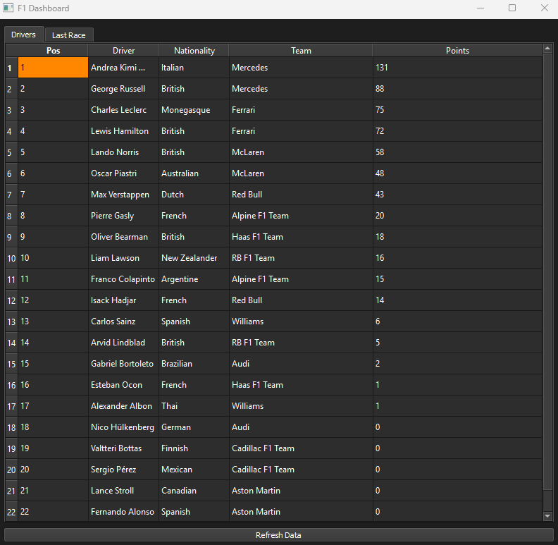

# F1 Dashboard

A desktop application built with Python and PyQt5 which displays live information on the current Formula 1 season, including driver information, driver championship (including live points) and last race's result.

## Screenshot

Below is a screenshot of the live information available in my application on the Driver Championship, as of 3/6/26.

## Features

F1 Dashboard is able to:
- View current driver championship standings with points
- View last race results including finishing position and team represented
- Refresh the live data using a button

## Tech Stack

- Python 3.14
- PyQt5 - desktop GUI framework
- Requests (HTTP API calls)
- OpenF1 API - live session and driver data
- Jolpica API - championship standings and points

## APIs

My application relies on two different APIs for its information - OpenF1 & Jolpica. This is because during development, I found OpenF1 to lack some information I believed users would want, therefore a secondary API was necessary.

## How to Run

1. Clone the repository
2. Create a virtual environment: `python -m venv venv`
3. Activate it: `venv\Scripts\activate`
4. Install dependencies: `pip install -r requirements.txt`
5. Run the app: `python main.py`

## Author

Robbie Nimick - https://github.com/RobbieNimick